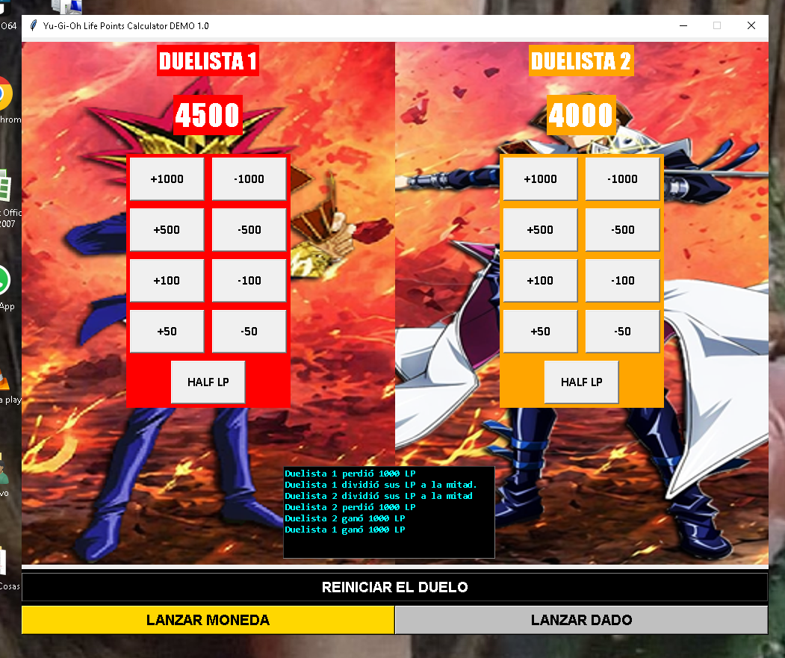
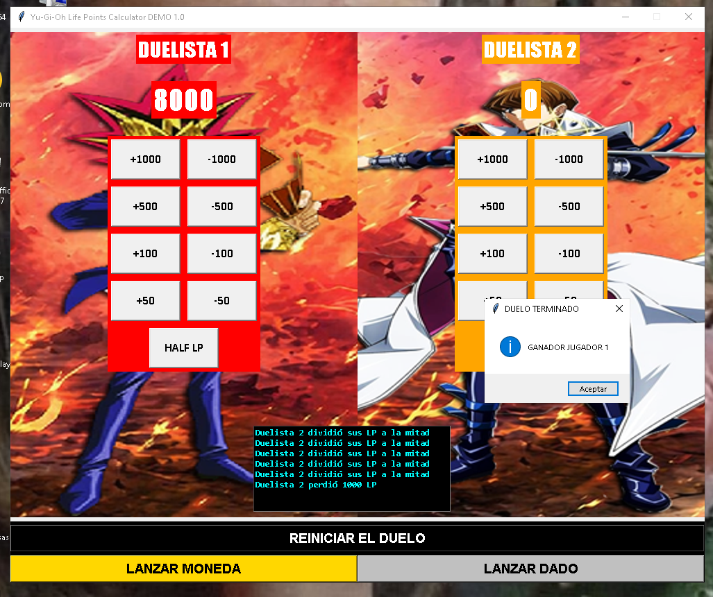
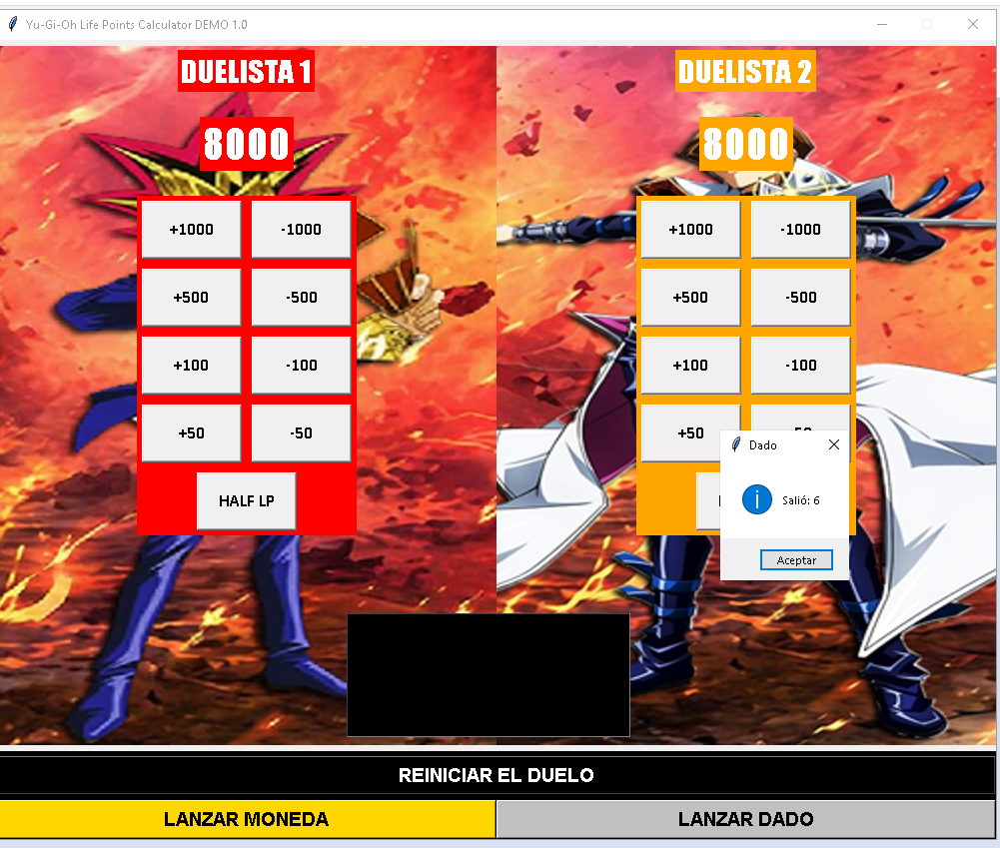
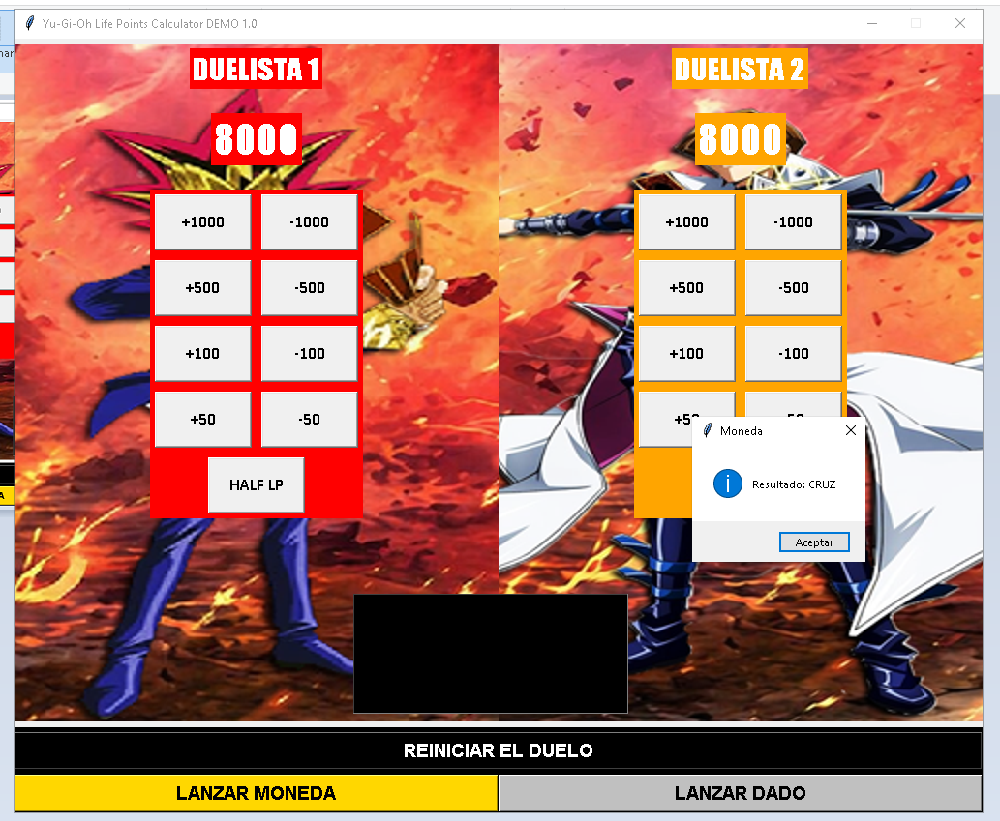

# NOMBRE DEL PROYECTO

Yu-Gi-Oh! Life Points Calculator DEMO 4

Aplicación desarrollada en Python que permite llevar el control de los Life Points (LP) de dos jugadores en partidas de Yu-Gi-Oh!.

# Descripción

Este programa nos muestra el sistema de puntos de vida del juego Yu-Gi-Oh!, permitiendo sumar, restar y dividir los puntos de forma rápida y sencilla durante una partida.

Fue desarrollado como proyecto práctico y de gusto personal para mejorar habilidades en Python y desarrollo de interfaces.

# Funcionalidades del programa
* Control de puntos de vida para 2 jugadores
* Sumar puntos
* Restar puntos
* Dividir puntos
* Lanzar un dado
* Lanzar una moneda
* Historial 
* Reiniciar partida
* Interfaz simple e intuitiva

# Tecnologías utilizadas
* Python
* Tkinter (interfaz gráfica)

# Cómo ejecutar el proyecto
Descargar o clonar el repositorio.
Abrir la carpeta del proyecto.
Ejecutar el archivo principal:
Yugioh Life Points Calculator DEMO 4.py

# Capturas

# Objetivo del proyecto

Este proyecto fue creado con el objetivo de practicar:
* Manejo de interfaces gráficas
* Lógica de programación
* Interacción con el usuario

# Estado del proyecto

Finalizado (con posibilidad de mejoras futuras)

# Posibles mejoras
* Agregar nuevos sonidos
* Soporte para más de 2 jugadores
* Diseño visual más avanzado

# Autor

Desarrollado por Santiago Catalán

# Licencia

Este proyecto es de uso libre para aprendizaje y práctica